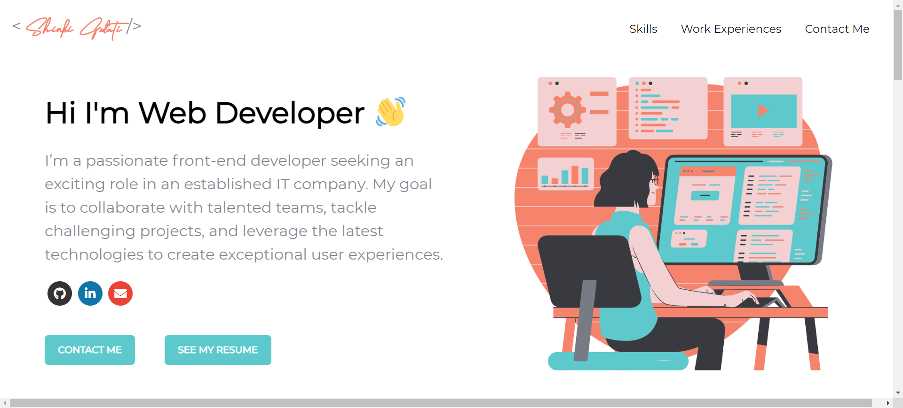

# My Frontend Developer Portfolio

Welcome to my frontend Developer portfolio! This project showcases my skills, projects, and experiences as a frontend developer. It's built using React, providing a responsive and interactive user experience.

## Table of Contents

- [Demo](#demo)
- [Features](#features)
- [Installation](#installation)
- [Usage](#usage)
- [Technologies Used](#technologies-used)
- [Project Structure](#project-structure)
- [Contributing](#contributing)
- [License](#license)

## Demo



## Features

- Responsive design for various screen sizes.
- Interactive components to showcase projects, skills, and experiences.
- Contact section with links to social media.
- Animated elements for an engaging user experience.

## Installation

1. Clone the repository:

   ```bash
   git clone https://github.com/shinkigulati1008/shinki-portfolio.git